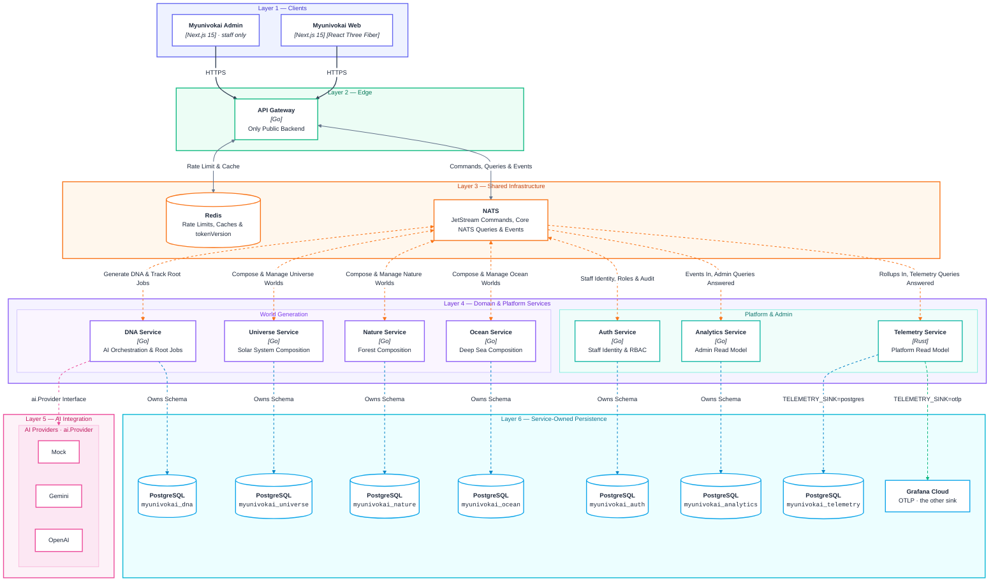
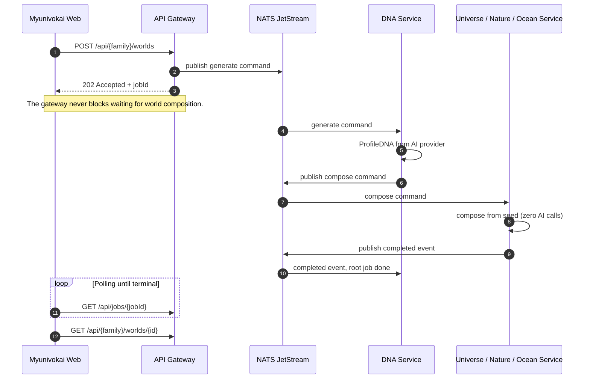

# Myunivokai

> *Have you ever wondered what a world built from who you are would look like?*  
> **Myunivokai** (*My Universe? OK, AI!*) transforms your personality into an AI-generated 3D world that's uniquely yours.

Describe yourself once. The platform synthesizes a canonical **ProfileDNA** from your narrative, then deterministically composes an interactive 3D scene — a **Universe** (Solar System), **Nature** (Forest), or **Ocean** (Deep Sea) — rendered directly in your browser with procedural ambient soundscapes.

---

## Architecture



| Line style | Meaning |
| --- | --- |
| **Solid dark** | HTTPS (Clients → Gateway) |
| **Solid grey** | Rate limit, cache & NATS dispatch (Gateway ↔ Redis / NATS) |
| **Dotted orange** | Commands, queries & events (NATS ↔ services) |
| **Dotted pink** | AI provider call (`dna-service` → `ai.Provider`) |
| **Dotted blue** | Owns schema (service → PostgreSQL) |
| **Dashed green** | Telemetry sink (`TELEMETRY_SINK=otlp` → Grafana Cloud) |

- **Strict Data Boundaries**: Each service owns its own PostgreSQL database; no service ever queries another's tables directly.
- **Single Public Entry**: Only `api-gateway` is exposed to the internet. NATS, Redis, and all domain services remain private.
- **Async Workers**: Domain services are headless NATS workers with no public HTTP business API.
- **CQRS Read Models**: `analytics-service` and `telemetry-service` are read models that consume events from NATS and answer queries without waking or waiting on domain services.
- **AI Isolation**: AI providers sit strictly behind `dna-service`. All world generation (`universe`, `nature`, `ocean`) is 100% deterministic mathematical composition.

| Service | Responsibility |
| --- | --- |
| `services/api-gateway` | **[Go]** The only public-facing backend. Validates input, dispatches commands to NATS, returns `202 + jobId`, and manages Redis caching. |
| `services/dna-service` | **[Go]** Handles AI orchestration (`ai.Provider`), root generation jobs, immutable `ProfileDNA` versioning, and the transactional outbox. |
| `services/universe-service` | **[Go]** Computes deterministic solar-system worlds and variants from a seed. No AI calls. |
| `services/nature-service` | **[Go]** Computes deterministic forest worlds and variants from a seed. No AI calls. |
| `services/ocean-service` | **[Go]** Computes deterministic deep-sea worlds from a seed and depth curve. No AI calls. |
| `services/auth-service` | **[Go]** Staff identity: authentication, token rotation, RBAC, and audit logs (Core NATS request-reply). |
| `services/analytics-service` | **[Go]** The admin CQRS read model. Consumes JetStream events and answers admin metrics/projection queries. |
| `services/telemetry-service` | **[Rust]** The platform read model. Ingests minute-by-minute rollups from the gateway, storing metrics in Postgres or forwarding to Grafana Cloud. |

---

## Database Architecture & ERD

Myunivokai strictly enforces the **Database-per-Service** pattern. Each microservice manages its own schema via explicit SQL migrations.
Dưới đây là toàn cảnh Database Schema của hệ thống, được quy hoạch phân mảnh theo Vùng (Domain Regions), trải dàn hàng ngang để quan sát toàn bộ kiến trúc.

```text
=======================================================================================================================================================
                                                     REGION 1: WORLD GENERATION SERVICES (Family)
=======================================================================================================================================================
 [ myunivokai_dna ]                                                               [ myunivokai_{family} ] (universe, nature, ocean)
+--------------------------+ 1      N +--------------------------+               +--------------------------+
| PROFILES                 |----------| DNA_VERSIONS             |               | WORLDS                   |
+--------------------------+          +--------------------------+               +--------------------------+
| * id (PK)                |          | * id (PK)                |               | * id (PK)                |          +--------------------------+
|   raw_input              |          |   profile_id (FK)        |               |   source_job_id (UK)     | 1      N | WORLD_VARIANTS           |
|   created_at             |          |   source_job_id (UK)     |               |   profile_id             |----------|                          |
|   updated_at             |          |   version_number         |               |   dna_version_id         |          +--------------------------+
+--------------------------+          |   profile_dna            |               |   nickname               |          | * id (PK)                |
             | 1                      |   created_at             |               |   role                   |          |   world_id (FK)          |
             |                        +--------------------------+               |   visual_intent          |          |   variant_no             |
             |                                     | 1                           |   dna_snapshot           |          |   seed                   |
             | N (has many)                        |                             |   archetype              |          |   config                 |
+--------------------------+                       |                             |   scene_name             |          |   thumbnail_url          |
| GENERATION_JOBS          |-----------------------+ 0..1 (produces)             |   quote                  |          |   is_selected            |
+--------------------------+                                                     |   revision               |          |   created_at             |
| * job_id (PK)            |                                                     |   selected_variant_id(FK)|<-+       +--------------------------+
|   family                 |                                                     |   created_at             |  |                    |
|   profile_id (FK)        |                                                     |   updated_at             |  | 0..1               | 1 (selected)
|   status                 |                                                     +--------------------------+  +--------------------+
|   dna_version_id (FK)    |                                                                  | 1
|   world_id               |                                                                  |
|   error_code             |                                                                  | 0..1 (shares)
|   error_message          |                                                     +--------------------------+
|   created_at             |                                                     | WORLD_SHARES             |
|   completed_at           |                                                     +--------------------------+
+--------------------------+                                                     | * id (PK)                |
             | 1                                                                 |   world_id (FK)          |
             |                                                                   |   share_slug (UK)        |
             | N (tracks)                                                        |   created_at             |
+--------------------------+                                                     +--------------------------+
| AI_GENERATION_ATTEMPTS   |
+--------------------------+                                                     +--------------------------+          +--------------------------+
| * id (PK)                |                                                     | INBOX_MESSAGES           |          | OUTBOX_MESSAGES          |
|   job_id (FK)            |                                                     +--------------------------+          +--------------------------+
|   provider               |                                                     | * message_id (PK)        |          | * id (PK)                |
|   model                  |                                                     |   subject                |          |   message_id (UK)        |
|   input_hash             |                                                     |   job_id                 |          |   subject                |
|   request_json           |                                                     |   processed_at           |          |   payload                |
|   response_json          |                                                     +--------------------------+          |   published_at           |
|   usage_json             |                                                                                           +--------------------------+
|   latency_ms             |
|   status                 |
|   created_at             |
+--------------------------+

+--------------------------+          +--------------------------+
| INBOX_MESSAGES           |          | OUTBOX_MESSAGES          |
+--------------------------+          +--------------------------+
| * message_id (PK)        |          | * id (PK)                |
|   subject                |          |   message_id (UK)        |
|   job_id                 |          |   subject                |
|   processed_at           |          |   payload                |
+--------------------------+          |   published_at           |
                                      +--------------------------+


=======================================================================================================================================================
                                                     REGION 2: PLATFORM & ADMIN SERVICES
=======================================================================================================================================================
 [ myunivokai_auth ]                                                                              [ myunivokai_analytics ]   [ myunivokai_telemetry ]
+--------------------------+ 1      N +--------------------------+ N      1 +--------------------------+ +--------------------------+ +--------------------------+
| ACCOUNTS                 |----------| ACCOUNT_ROLES            |----------| ROLES                    | | JOB_PROJECTIONS          | | HTTP_ROLLUPS             |
+--------------------------+          +--------------------------+          +--------------------------+ +--------------------------+ +--------------------------+
| * id (PK)                |          | * account_id (PK, FK)    |          | * id (PK)                | | * job_id (PK)            | | * bucket_start (PK)      |
|   email (UK)             |          | * role_id (PK, FK)       |          |   name (UK)              | |   family                 | | * route_pattern (PK)     |
|   password_hash          |          +--------------------------+          |   audience               | |   status                 | | * method (PK)            |
|   kind                   |                                                |   is_system              | |   error_code             | | * status_class (PK)      |
|   is_super_admin         |          +--------------------------+ 1      N |   created_at             | |   world_id               | |   request_count          |
|   disabled               |          | PERMISSIONS              |----------+--------------------------+ |   created_at             | |   duration_sum_ms        |
|   token_version          |          +--------------------------+          | ROLE_PERMISSIONS         | |   completed_at           | |   duration_max_ms        |
|   failed_attempts        |          | * id (PK)                |          +--------------------------+ |   duration_ms            | |   histogram              |
|   locked_until           |          |   codename (UK)          |          | * role_id (PK, FK)       | |   projected_at           | +--------------------------+
|   created_at             |          |   audience               |          | * permission_id (PK, FK) | +--------------------------+ 
+--------------------------+          |   is_system              |          +--------------------------+                              +--------------------------+
     | 1            | 1               |   created_at             |                                       +--------------------------+ | NATS_ROLLUPS             |
     |              |                 +--------------------------+                                       | WORLD_PROJECTIONS        | +--------------------------+
     | N            | N                                                                                  +--------------------------+ | * bucket_start (PK)      |
+--------------------------+          +--------------------------+                                       | * world_id (PK)          | | * service (PK)           |
| REFRESH_TOKENS           |          | AUDIT_EVENTS             |                                       |   family                 | |   request_count          |
+--------------------------+          +--------------------------+                                       |   profile_id             | |   duration_sum_ms        |
| * id (PK)                |          | * id (PK)                |                                       |   dna_version_id         | |   error_count            |
|   account_id (FK)        |          |   actor_id (FK)          |                                       |   source_job_id          | |   histogram              |
|   family_id              |          |   action                 |                                       |   revision               | +--------------------------+
|   token_hash (UK)        |          |   target                 |                                       |   nickname               |
|   used_at                |          |   result                 |                                       |   archetype              | +--------------------------+
|   revoked_at             |          |   occurred_at            |                                       |   mood                   | | CACHE_ROLLUPS            |
|   expires_at             |          +--------------------------+                                       |   world_style            | +--------------------------+
+--------------------------+                                                                             |   favorite_colors        | | * bucket_start (PK)      |
                                                                                                         |   trait_creativity       | | * namespace (PK)         |
                                                                                                         |   trait_energy           | |   hits                   |
                                                                                                         |   variant_count          | |   misses                 |
                                                                                                         |   is_published           | +--------------------------+
                                                                                                         |   world_created_at       |
                                                                                                         |   projected_at           | +--------------------------+
                                                                                                         +--------------------------+ | ERROR_CODE_ROLLUPS       |
                                                                                                                                      +--------------------------+
                                                                                                         +--------------------------+ | * bucket_start (PK)      |
                                                                                                         | INBOX_MESSAGES           | | * error_code (PK)        |
                                                                                                         +--------------------------+ |   count                  |
                                                                                                         | * message_id (PK)        | +--------------------------+
                                                                                                         |   subject                |
                                                                                                         |   job_id                 |
                                                                                                         |   processed_at           |
                                                                                                         +--------------------------+
```

---
## How a Request Travels



---

## Core Concepts

| Concept | Description |
| --- | --- |
| **ProfileDNA** | The AI-generated semantic profile: archetype, narrative, traits, energy, facets, and palette intent. This is the **only** output AI produces. |
| **World Seed** | A deterministic numeric seed. Same seed = identical 3D scene on any device. Randomness is forbidden in 3D rendering code. |
| **World Scene Config** | The complete numeric tree for 3D rendering (objects, geometry, shaders, lighting). Computed deterministically from the seed with zero AI cost. |
| **Variant** | An alternative scene config for the same world generated from a new seed at zero AI cost. |
| **Ambient Soundscape** | Procedural music synthesized in-browser via Web Audio API using public-domain compositions and real instrument samples arranged by the DNA. |
| **Rare Features** | Special features (black holes, binary suns, deep trenches) rolled client-side from the seed. |
| **Async Job & Polling** | Gateway returns `202 + jobId`. The frontend polls `GET /api/jobs/{jobId}` until generation is complete. |

---

## Tech Stack

| Area | Technologies |
| --- | --- |
| **Frontend** | Next.js 15, React 19, TypeScript, React Three Fiber, Three.js, Web Audio API, Tailwind CSS |
| **Backend** | Go (chi, pgxpool, zerolog), Rust (`telemetry-service`, sqlx, tokio) |
| **Messaging & Cache** | NATS JetStream (durable events & commands), Core NATS (request-reply), Redis (rate limiting & cache) |
| **Persistence** | PostgreSQL 17 (Database-per-service on Neon in production), Raw SQL (No ORM) |
| **AI Providers** | Google Gemini, OpenAI, Mock provider (pluggable via `ai.Provider` interface) |
| **Infrastructure** | Docker Compose (local), Render (production), GitHub Actions (CI) |

---

## Quickstart — Run Locally

### Prerequisites
- **Docker Desktop** (with Compose v2.20+)
- **Go 1.23+** and **Node.js 20+** (only if developing outside Docker)

### 1. Start the Full Stack

```bash
# 1. Initialize local environment (uses local-only credentials)
cp .env.example .env.local

# 2. Start all services, databases, and message brokers
make local-up
# or: docker compose --env-file .env.local -f docker-compose-local.yaml up --build
```

### 2. Service Endpoints

| Service | URL | Role |
| --- | --- | --- |
| **Web App** | http://localhost:41300 | 3D World generator & viewer |
| **Admin Console** | http://localhost:41900 | Staff management dashboard |
| **API Gateway** | http://localhost:41800 | Public API endpoint (`/api/v1/healthz`) |

### 3. Create First Admin Account

```bash
docker compose --env-file .env.local -f docker-compose-local.yaml exec auth-service go run ./cmd/bootstrap --email admin@myunivokai.local --password "ChangeMe12345Local"
```
Log in to the Admin Console at `http://localhost:41900/login` with your bootstrap credentials.

### 4. Stop the Stack

```bash
make local-down
```

---

## Repository Layout

```txt
.
├── apps/
│   ├── myunivokai-web/               # Next.js 15 + React Three Fiber 3D client
│   └── myunivokai-admin/             # Next.js 15 staff management console
├── services/
│   ├── api-gateway/                  # Public Go edge gateway (routing, rate limiting, caching)
│   ├── dna-service/                  # AI orchestration worker (ProfileDNA synthesis)
│   ├── universe-service/             # Solar System 3D world generator (Go)
│   ├── nature-service/               # Forest 3D world generator (Go)
│   ├── ocean-service/                # Deep Sea 3D world generator (Go)
│   ├── auth-service/                 # Staff identity, RBAC & token rotation (Go)
│   ├── analytics-service/            # Admin CQRS read model (Go)
│   └── telemetry-service/            # Platform metrics read model (Rust)
├── contracts/                        # Cross-service schemas, Go contracts & OpenAPI specifications
├── infra/                            # Local development Docker Compose, NATS & PostgreSQL configs
└── notes/                            # Comprehensive engineering and architecture documentation
```

### Root Configs & Files

| File | Purpose |
| --- | --- |
| `AGENTS.md` | Core instructions, mission, and strict rules for AI assistants operating in this repository. |
| `docker-compose-local.yaml` | Local development environment orchestrating all services, databases, and brokers. |
| `Makefile` | CLI shortcuts for common development workflows (e.g., `make local-up`, `make local-down`). |
| `render.yaml` | Infrastructure-as-Code (IaC) configuration for deploying services and databases to Render. |
| `.env.example` | Template demonstrating all required environment variables for the system. |
| `.gitignore` / `.gitattributes` | Source control definitions for ignored paths and git text handling. |

---

## Documentation

Comprehensive internal engineering documents are maintained in the [`notes/`](notes/README.md) folder.

Key references:
- [`notes/coding/git-convention.md`](notes/coding/git-convention.md) — Mandatory branch naming and commit conventions
- [`notes/coding/coding-style.md`](notes/coding/coding-style.md) — Code style rules (no hardcoded values, clean names)
- [`notes/be/source-overview.md`](notes/be/source-overview.md) — Backend architecture & microservice patterns
- [`notes/be/request-lifecycle.md`](notes/be/request-lifecycle.md) — Detailed request paths & cache invalidation
- [`notes/be/design-decisions.md`](notes/be/design-decisions.md) — Design rationales (AI boundaries, deterministic math, public domain music)
- [`notes/fe/source-overview.md`](notes/fe/source-overview.md) — Frontend architecture & 3D scene registry
- [`notes/fe/threejs-scene-architecture.md`](notes/fe/threejs-scene-architecture.md) — 3D scene rendering principles
- [`notes/ops/production-deployment-guide.md`](notes/ops/production-deployment-guide.md) — Full production deployment runbook
