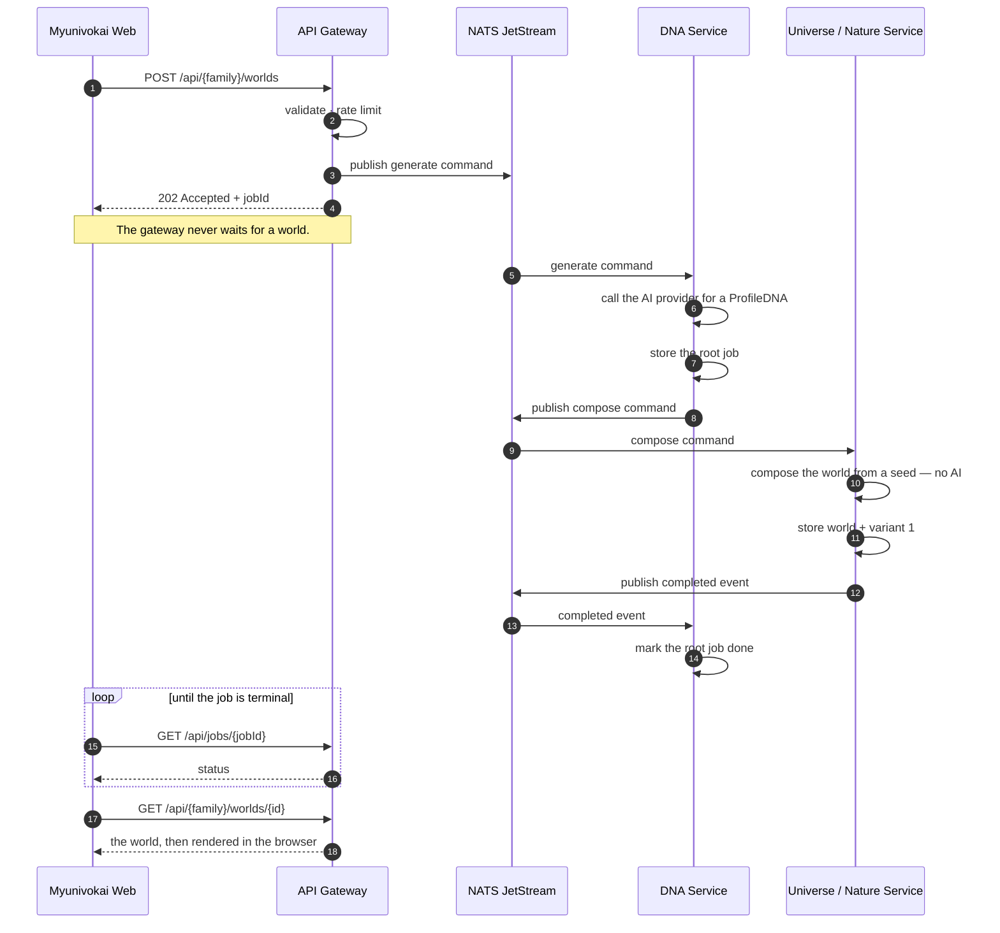

# Request lifecycle — from a POST to a rendered world, and back out again

> **Document status:** Implemented
> **Last source review:** 2026-08-13

Five paths that used to live in the root `README.md`. They were moved here
because they answer "how does a request actually travel", which is a question a
contributor asks once they are already working in the code — not one a reader
landing on the repository has. The README keeps the shape of the system and one
sequence diagram; this file keeps the detail.

| Section | Question it answers |
| --- | --- |
| [Generation flow](#generation-flow) | What happens between `POST` and a world existing |
| [World lifecycle](#world-lifecycle-after-generation) | What can be done to a world afterwards |
| [Gateway caching and invalidation](#gateway-caching-and-invalidation) | Which Redis key is deleted by what, and the bug that proved why |
| [Admin read path](#admin-read-path) | How the admin app sees data it is never allowed to query directly |
| [Waking a sleeping service](#waking-a-sleeping-service) | What `no-responders` means on a scale-to-zero plan |

---

## Generation flow

`{family}` is `universe` or `nature`. Both families use identical request
shapes.

The single most important property in that diagram is step 4: the `202`
arrives before any of the work below it has happened. Everything after it is
asynchronous, and the frontend's polling loop is what turns it back into a
synchronous-feeling experience.

## World lifecycle after generation

| Route | What it does |
| --- | --- |
| `GET /api/{family}/worlds/{id}` | The private dashboard read, cached in Redis. |
| `POST /api/{family}/worlds/{id}/variants` | New seed, new scene, **zero AI cost**. |
| `POST /api/{family}/worlds/{id}/variants/{variantId}/select` | Pick what is shown. |
| `POST /api/{family}/worlds/{id}/publish` | Mint the share slug once, then reuse it. |
| `GET /api/{family}/share/worlds/{slug}` | Public, privacy-safe, cached in Redis. |

Frontend share pages live at `/universe/share/worlds/{slug}` and
`/nature/share/worlds/{slug}`.

## Gateway caching and invalidation

Three Redis namespaces: `job:v1`, `world:v1`, `share:v1`. `world:v1` is keyed
by world id; `share:v1` is keyed by share slug.

Every mutation deletes `world:v1` before **and** after the call. The
before-and-after pair is not belt-and-braces: deleting only afterwards leaves a
window in which a concurrent read repopulates the key from the pre-mutation
state.

The share key is the subtle one. A mutation cannot derive the slug from a world
id, so the domain service returns `shareSlug` in its response and the gateway
deletes `share:v1` with it. Without that, selecting a variant left the share
page serving the previous scene for a whole TTL — which presented as *the share
page losing scene features*, not as a caching bug, and is the reason this
paragraph exists.

The hit rate for all three namespaces is measured. See the **Performance**
screen in the admin app, and
[telemetry-service-plan.md](../vision/telemetry-service-plan.md).

## Admin read path

- Every world mutation above also bumps `worlds.revision` and writes a
  `world.changed` snapshot to the outbox **inside the same transaction**.
- `analytics-service` consumes those events into its own database:
  `world_projections` and `job_projections`, guarded by an inbox table and an
  upsert that only ever moves a world's `revision` forward.
- `/api/admin/{overview,timeseries,worlds,jobs}` reads from that model alone.
  No admin route ever publishes a `universe`, `nature` or `dna` subject, and a
  gateway test asserts it.
- The read model is **eventually consistent**: a new world appears in the admin
  app seconds after it is created. That is the accepted trade for an admin page
  that waits on two processes instead of four.
- The cost to keep paying: a future mutation that forgets its event drifts the
  read model silently. `world_snapshot_test.go` in both family services asserts
  every mutating store method leaves an event behind.

Full rationale: [analytics-service-plan.md](../vision/analytics-service-plan.md).

## Waking a sleeping service

Every service except the gateway is a pure NATS consumer, so on a scale-to-zero
plan nothing ever sends it the inbound HTTP it needs to wake up. A query against
a sleeping service comes back as `no-responders` **immediately** — not as a
timeout — and the gateway used to report that as the same
`503 SERVICE_UNAVAILABLE` it reports for a genuinely broken broker.

| Response | Meaning | Safe to retry |
| --- | --- | --- |
| `503 SERVICE_WAKING` + `Retry-After` | Nobody was subscribed. The gateway has started the service and the request never reached it. | Yes, any method |
| `503 SERVICE_UNAVAILABLE` | A real fault. | No |
| `504 SERVICE_TIMEOUT` | Awake, just slow. | Depends on the method |

Both frontends wait out a `SERVICE_WAKING`.

Reads wake reactively. `POST /api/{family}/worlds` cannot: a JetStream publish
succeeds with no consumer alive, so that path would return `202` and stall at
`queued` with no error anywhere — it wakes dna and the family service *before*
publishing instead.

One call per sleeping service per lock window, triggered by a real request,
never on a schedule. A keep-alive cron is exactly what the free tier's
account-wide hour budget rules out. `SERVICE_WAKE_PLATFORM=none` is the default
and the correct value on any always-on host, so leaving the free tier is one
line of config.

How often this actually fires is on the admin app's **Reliability** screen, as
the `SERVICE_WAKING` count. It is deliberately not styled as a fault there: it
is the cost of scale-to-zero working as designed.

Self-hosting is the exception, and it is the interesting one: a supervisor takes
over restarting, but `no-responders` stops meaning *"asleep"* and starts meaning
*"crashed"* — so the classification and the statistics around the wake become
incident detection rather than a workaround. See
[service-wake-mechanism.md](../vision/service-wake-mechanism.md), which records
exactly which parts survive each destination and which one should be deleted.

---

## Related

- [source-overview.md](source-overview.md) — what each service contains
- [rust-service-architecture.md](rust-service-architecture.md) — the one service that is not Go
- [design-decisions.md](design-decisions.md) — why AI touches only the semantic layer
