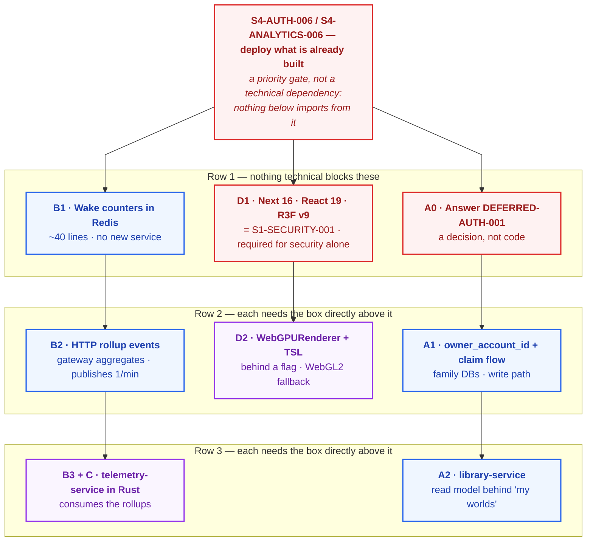

# Platform evolution research — end-user identity, telemetry, Rust, WebGPU

> **Document status:** Research. **Nothing here is approved**, and only one
> piece has been built — §B1, the wake counters, because they were cheap enough
> to fall out of the wake mechanism itself. Everything else exists so four owner
> proposals can be argued against the real source before any of them becomes a
> sprint.
> **Raised:** 2026-08-11 by the owner
> **Last source review:** 2026-08-12 (B1 built)
> **Graduation path:** whichever tracks are approved get copied into
> `versions/v2-YYYY-MM-DD/` as a frozen baseline and the pointer table in
> [README.md](README.md) is updated. Until then this file is the only
> record, and `versions/v1-2026-07-22/` remains the current architecture.

Four proposals, deliberately in one document because they are not independent:
two of them share a deliverable, one is unlocked by work already required for
another reason, and one is gated on a decision that was deferred a year ago
and never revisited.

| Track | Proposal | Verdict |
| --- | --- | --- |
| [A](#track-a--end-user-identity-and-world-ownership) | End-user login; worlds owned across two databases | Sound, but **blocked on a decision, not on code** |
| [B](#track-b--operational-telemetry) | Wake counts, request counts, status codes in a dashboard | Best value per hour. **B1 is built**; the rest stands. **One trap: it must not go into `analytics-service`**. Amended by [telemetry-architecture-research.md](telemetry-architecture-research.md) |
| [C](#track-c--a-service-written-in-rust) | A service in Rust, to learn Rust | **Decided 2026-08-13:** `telemetry-service` in Rust, per [telemetry-service-plan.md](telemetry-service-plan.md). Was blocked on B2's landing place; the plan resolves that by building both landing places behind one switch. Amended by [rust-adoption-research.md](rust-adoption-research.md) |
| [D](#track-d--webgpu-instead-of-webgl) | WebGPU replacing WebGL | Real, cheap **after** an upgrade already required for security. Low return today |

---

## The dependency graph

The single most useful output of this research. Solid arrow = hard block.



Read it as three independent chains — **telemetry**, **frontend**, **identity**
— that share no code and can run in any order relative to each other.

Two things this graph makes obvious that prose did not:

1. **`A0` is not engineering work.** Track A cannot start, and the answer costs
   a conversation, not a sprint. It should be scheduled first precisely because
   it is cheap and everything else in that track waits on it.
2. **`D1` is on the critical path whether or not WebGPU is ever built.** It is
   `S1-SECURITY-001`, which is open for security reasons independent of this
   document. WebGPU is a by-product of paying a debt that is already due.

---

## Track A — end-user identity and world ownership

### The question, restated correctly

> *"Lưu khóa ngoại ra sao? Nằm 2 services 2 DB riêng."*

**There is no foreign key, and there cannot be one.** `myunivokai_auth` and
`myunivokai_universe` are separate Neon projects; PostgreSQL cannot
`REFERENCES` across a database, let alone across a host. This is already the
repo's written rule — [../be/source-overview.md](../be/source-overview.md):

> There are no cross-database foreign keys. IDs and immutable snapshots cross
> boundaries only through NATS contracts.

So the design question is not "how do we keep the FK". It is: **a foreign key
does three separate jobs, and each one needs its own replacement.**

| What `REFERENCES accounts(id)` gives you | Replacement across a service boundary |
| --- | --- |
| The account exists at write time | The **Ed25519 signature on the access token** is the proof. The family service verifies a signature; it never asks `auth-service` anything. This is stronger than an FK — an FK proves a row existed, a signature proves the issuer vouched for it |
| `ON DELETE CASCADE` | An `account.deleted` event and one handler per owning service. This is a **GDPR obligation**, not a convenience, so it must be built with the ownership column, never after |
| `JOIN` for "all worlds of user X" | A read model. This is the whole of the rest of this track |

Nothing about this is exotic — AWS's decomposition guidance calls the first
row *reference by key*, and the third is textbook CQRS. What makes the choice
non-obvious here is the wake mechanism, which changes the cost of the options.

### Three candidate patterns

**Pattern 1 — `owner_account_id` in each family database, gateway fans out**

`GET /api/me/worlds` asks universe **and** nature, then merges.

Rejected. Two independent reasons, either sufficient:

- **Wake cost.** One page load wakes two services today and three once City
  lands. Each is a 20–60 s cold start, and they are not parallel from the
  user's point of view — the page is blocked on the slowest.
- **Pagination is not composable.** Keyset pagination over *N* sources requires
  over-fetching `pageSize` from every source, merge-sorting, discarding the
  remainder, and carrying a per-source cursor in one opaque token. Cost grows
  with family count while the page size stays 25.

This is the same fan-out
[analytics-service-plan.md](analytics-service-plan.md) already rejected for the
admin console. The reasoning has not changed; only the caller has.

**Pattern 2 — a dedicated read model, fed by the events that already exist**

One service owns a denormalised `world_ownership` projection across all
families. `GET /api/me/worlds` is one query, one service woken, one keyset
cursor.

This is not a new pattern for this repo. It is `analytics-service`, which is
already in production and already consumes `myunivokai.events.>`.

**Pattern 3 — ownership rows inside `auth-service`**

Rejected. `auth-service` would have to know what a world is, which breaks its
bounded context, and the page would *still* need the family service for world
detail — reintroducing the fan-out that pattern 1 was rejected for.

### Recommendation: patterns 1 and 2 together, for different paths

This is the part most likely to be got wrong, so it is stated as a rule:

> **A read model may never be the basis of an authorization decision.**
> It is eventually consistent. A window of a few hundred milliseconds to a few
> seconds exists between the write and the projection, and "may this account
> delete this world" answered from inside that window is a security hole.

Therefore:

| Path | Source of truth | Why |
| --- | --- | --- |
| **Write** — delete, publish, create a variant | `worlds.owner_account_id` in the family database, checked **inside the same transaction** as the mutation | Cannot be stale. Cannot race |
| **Read** — "my worlds", counts, filters | the read model | One service, one cursor, no fan-out |

That is CQRS used correctly: reads and writes are separated, the write path is
not replaced by the read path.

### Concrete schema — family services

Identical migration in `universe-service` and `nature-service`:

```sql
-- 000003_world_ownership.sql
-- +goose Up

-- Nullable on purpose, twice over:
--   1. every world already in production is anonymous and must stay valid;
--   2. anonymous creation is not being removed - a visitor still gets a world
--      without an account, which is the product's entire first impression.
-- No REFERENCES: accounts live in another database on another host. The token
-- signature is the existence proof; see the FK-replacement table above.
ALTER TABLE worlds ADD COLUMN owner_account_id UUID;

-- The bearer credential for a world created before login. httpOnly cookie,
-- minted by the gateway, exchanged exactly once at claim time.
ALTER TABLE worlds ADD COLUMN anonymous_id UUID;

-- Partial: only owned rows are ever listed by owner, and the index should not
-- carry the anonymous majority.
CREATE INDEX worlds_owner_keyset_idx
  ON worlds (owner_account_id, created_at DESC, id DESC)
  WHERE owner_account_id IS NOT NULL;

CREATE INDEX worlds_anonymous_idx
  ON worlds (anonymous_id)
  WHERE anonymous_id IS NOT NULL AND owner_account_id IS NULL;

-- +goose Down
DROP INDEX worlds_anonymous_idx;
DROP INDEX worlds_owner_keyset_idx;
ALTER TABLE worlds DROP COLUMN anonymous_id;
ALTER TABLE worlds DROP COLUMN owner_account_id;
```

`ADD COLUMN` with no default is metadata-only on PostgreSQL 11+, so this is
instant against live tables.

### Concrete schema — the read model

New service, `services/library-service`, database `myunivokai_library`. It is
**not** `analytics-service`: that database is admin-only, its contents are a
published allow list, and user-owned data carries deletion and export
obligations that admin projections do not.

```sql
-- 000001_init.sql
CREATE TABLE world_ownership_projections (
  world_id          UUID PRIMARY KEY,
  owner_account_id  UUID NOT NULL,
  family            TEXT NOT NULL,
  revision          INTEGER NOT NULL,   -- same forward-only guard as analytics
  nickname          TEXT NOT NULL,
  archetype         TEXT NOT NULL,
  scene_name        TEXT NOT NULL,
  mood              TEXT NOT NULL,
  world_style       TEXT NOT NULL,
  variant_count     INTEGER NOT NULL DEFAULT 1,
  is_published      BOOLEAN NOT NULL DEFAULT FALSE,
  share_slug        TEXT,               -- the owner may see their own slug
  world_created_at  TIMESTAMPTZ NOT NULL,
  projected_at      TIMESTAMPTZ NOT NULL DEFAULT NOW()
);

-- One index, matched to the only query this service answers.
CREATE INDEX world_ownership_keyset_idx
  ON world_ownership_projections (owner_account_id, world_created_at DESC, world_id DESC);

CREATE TABLE inbox_messages (
  message_id   TEXT PRIMARY KEY,
  subject      TEXT NOT NULL,
  job_id       TEXT NOT NULL,
  processed_at TIMESTAMPTZ NOT NULL DEFAULT NOW()
);
```

No `outbox_messages`, for the same reason `analytics-service` has none: it
consumes, projects and answers. It publishes nothing.

**`share_slug` is the one field that differs in sensitivity from the analytics
projection**, which deliberately excludes it. It is included here because the
owner is entitled to their own share link, and excluded from analytics because
a staff member is not. If that reasoning is ever weakened, the field goes.

### Contracts

```go
// contracts/go/contracts_library.go
const (
    // The gateway already publishes myunivokai.queries.> - no ACL change.
    LibraryWorldListQuerySubject = "myunivokai.queries.library.world.list.v1"

    // Claim is a command, not a query: it mutates two family databases and
    // must survive the browser navigating away mid-flight.
    WorldClaimCommandSubject = "myunivokai.commands.%s.world.claim.v1" // family

    // Ownership is stripped from a deleted account across every service that
    // holds it. Wildcard consumers already receive myunivokai.events.> .
    AccountDeletedEventSubject = "myunivokai.events.auth.account.deleted.v1"
)
```

`WorldSnapshot` gains `OwnerAccountID *uuid.UUID` — a pointer, so events
already on the stream decode to `nil` rather than a misleading zero UUID.
Adding it requires the matching line in the analytics data boundary, per the
rule in [README.md](README.md) §What must not happen. **The owner id must
not be projected into `myunivokai_analytics`** — staff have no business
reading who owns what. `library-service` reads the same event and keeps the
field; `analytics-service` drops it. One event, two consumers, two allow lists.

### The anonymous claim flow

The hardest part of this track, and the reason `DEFERRED-AUTH-001` exists.
Every world in production today has no owner.

```
1. POST /api/universe/worlds  (no session)
   gateway sets  anonymousId=<uuid>  as httpOnly · Secure · SameSite=Lax
   and puts it in the compose command; the family service stores it.

2. ... visitor creates several worlds over several days, same cookie ...

3. visitor signs up / logs in  -> product access token

4. POST /api/me/worlds/claim   (access token + anonymousId cookie both present)
   gateway publishes one claim command per family.

5. each family service, in one transaction:
     UPDATE worlds
        SET owner_account_id = $account, anonymous_id = NULL, revision = revision + 1
      WHERE anonymous_id = $anonymous AND owner_account_id IS NULL
     + one world.changed outbox row per updated world

6. library-service projects them. The gateway clears the cookie.
```

Properties that matter:

- **Idempotent.** `owner_account_id IS NULL` makes a replayed claim a no-op.
  A world is claimable exactly once, forever.
- **Reuses machinery that already exists.** `revision` + outbox +
  `world.changed` are in production; the claim writes no new event type.
- **The cookie is a bearer credential.** Anyone holding it owns those worlds.
  `httpOnly` keeps it away from XSS, `Secure` off plaintext, `SameSite=Lax`
  off cross-site POSTs. It must expire — 90 days is a defensible default and
  is an owner decision, not an implementation detail.
- **Step 5 must wake the family services.** See the retention trap below.

### Deletion and export

Not optional and not deferrable to a later sprint, because the ownership
column is what creates the obligation:

- `account.deleted` → each family service **nulls** `owner_account_id` (worlds
  survive, anonymised) **or deletes** the worlds. This is an owner decision
  with legal weight, and it must be made before the column ships.
- `library-service` deletes every row for that account. A read model holding
  personal data after an erasure request is the exact failure regulators look
  for.
- Export: `library-service` can produce the whole set in one query, which is
  a second reason the read model exists.

### The retention trap — and it applies to `library-service` too

`analytics-service` already has this problem and `library-service` would
inherit it:

> A read model on a scale-to-zero plan wakes only when someone queries it.
> `MYUNIVOKAI_EVENTS` retains **7 days**
> ([analytics runtime.go:85](../../services/analytics-service/internal/messaging/runtime.go#L85)).
> If nobody opens the screen for eight days, the oldest events expire
> **unconsumed** and the projection is permanently wrong, with no error
> anywhere.

Three mitigations, and the first is the one that composes:

1. **Wake the read model on the write path**, exactly as `POST /worlds`
   already wakes dna and the family service. The consumer wakes at the moment
   there is something for it to consume. Cost: the read model stays up for one
   idle window per burst of activity.
2. Raise stream `MaxAge` to 30 days on managed NATS. Check the plan's storage
   quota first.
3. Human discipline. Fails eventually, by construction.

**This is a defect in the current system, not only in the proposal.** It should
be fixed for `analytics-service` regardless of whether track A is ever built.

**Fixed for `analytics-service` on 2026-08-14**, by mitigation 1.
`WorldHandler.wakeReadModel` wakes the read model on each of the four mutations
that produce an event, after the write is accepted rather than before it, and
reads wake nothing — the two boundaries that keep it a wake rather than a
keep-alive, both held by a test in
`services/api-gateway/internal/handlers/wake_test.go`. It does not cover
`service.started`, which no client asks the gateway for; the reasoning for
leaving that uncovered is in
[service-wake-mechanism.md](service-wake-mechanism.md#what-was-built-and-where-it-differs-from-this-design).
Mitigation 2 remains available and independent, and would be worth taking on
managed NATS regardless.

### Identity issuer — the decision under `DEFERRED-AUTH-001`

`auth-service` today is staff-only, and the gateway's admin router is
default-deny on that assumption.

| Option | For | Against |
| --- | --- | --- |
| **Extend `auth-service`** | Argon2id, lockout, refresh rotation, audit and the token verifier all exist and are tested. No new service, no new wake surface | Staff and end users in one account table. A single bad role assignment becomes staff access to the console |
| **Separate `identity-service`** | Blast radius of an end-user bug cannot reach staff | Duplicates every hardened primitive above. A seventh free service |
| **External IdP** (Clerk / Auth0 / Supabase) | Email verification, OAuth, password reset, MFA — none of which exist here and all of which are real work | A vendor on the product's critical path; another free-tier limit; the gateway still needs local verification |

**Recommended: extend `auth-service`, with the separation enforced structurally
rather than by care.** Concretely:

- `accounts.kind` — `'staff' | 'end_user'`, `NOT NULL`, no default.
- Tokens carry an **audience**. `aud=admin` for staff, `aud=product` for end
  users. `middleware.RequireAdminAccessToken` rejects any token whose audience
  is not `admin`, so a product token is not merely under-privileged in the
  admin console — it is unreadable there.
- A repository-level invariant: **an `end_user` account can hold no permission
  row at all.** Enforced by a `CHECK`-backed trigger or by a unit test in the
  shape of `admin_router_test.go`, which already fails the build when a route
  is added without a guard. The same technique, applied to accounts.
- The bootstrap command stays staff-only.

That keeps the hardened code and removes the class of bug that made option 1
frightening.

### Wake budget

| Action | Services woken (worst case, all asleep) |
| --- | --- |
| Log in | gateway + auth = **2** |
| "My worlds" | gateway + library = **2** |
| Open one world | gateway + family = **2** |
| Claim after signup | gateway + universe + nature = **3**, once per account, ever |

Pattern 1 would make "my worlds" 3 today and 4 after City — permanently, on
the most frequently opened page in the product.

### Open decisions before any code

Restating [`DEFERRED-AUTH-001`](../user-stories/engineering-backlog.md) as
answerable questions:

1. Issuer: extend `auth-service` as recommended, or not?
2. Does an anonymous visitor still get a world without an account? (Assumed
   **yes** throughout this document; the whole claim design collapses to
   nothing if the answer is no.)
3. Anonymous cookie lifetime, and behaviour when it expires unclaimed.
4. `account.deleted`: anonymise the worlds, or delete them?
5. Does a published share survive its owner's deletion?
6. Can ownership be transferred? (If never, `owner_account_id` can be
   write-once, which removes a whole class of race.)
7. Are there per-account quotas — worlds, variants, publishes?

---

## Track B — operational telemetry

> **Amended 2026-08-13 by
> [telemetry-architecture-research.md](telemetry-architecture-research.md).**
> Nothing below is wrong. That document grounds the B2 sketch against three
> real large-system precedents (Uber M3, Datadog DogStatsD, the OpenTelemetry
> Collector), all of which aggregate the same way this sketch already does,
> and answers a question this document left open: this system's actual route
> cardinality (~200 series) is 2% of Grafana Cloud's free-tier budget, so the
> "which option" table below can be read as settled in Option 1's favour at
> this system's current size, not merely as a coin flip.
>
> **Decided 2026-08-13, graduated to
> [telemetry-service-plan.md](telemetry-service-plan.md).** The owner chose
> both: `telemetry-service` in Rust, writing through a switchable sink to
> either its own Postgres database or Grafana Cloud OTLP, with results
> rendered in `myunivokai-admin`. B2's gateway-side design below is adopted
> unchanged as that plan's phase 1.

### The data already exists

[`middleware/logging.go`](../../services/api-gateway/internal/middleware/logging.go)
already emits `method`, `path`, `status`, `duration`, `request_id` and
`client_ip` for every request. The proposal — *"số API được fetch, status trả
về ra sao"* — is not a data-collection problem.

It is a **sink** problem: those lines go to stdout, and a free-tier host does
not keep them.

### The trap: this must not go into `analytics-service`

Two independent reasons, either sufficient.

**The data boundary.** The analytics schema opens with a comment stating that
a reviewer who finds an outbox there should treat it as a design violation.
Its contents are an allow list tied to `contracts.WorldSnapshot`. Operational
telemetry is a different kind of data with a different retention (30–90 days
versus indefinite), different cardinality, and a different query shape
(time-bucketed versus keyset over business rows).

**Volume.** Business events are roughly one per world. Request events are one
per HTTP call — two to three orders of magnitude more. Mixed into one
database, the business read model becomes a rounding error inside a firehose,
and every admin aggregate slows down for it.

Large systems separate these completely: product analytics in one store,
operational telemetry in another. They are not the same discipline.

### The constraint that decides everything: pull is impossible here

> **Prometheus scrapes.** It polls an endpoint on a schedule. On this platform
> that is not merely awkward — a 15-second scrape interval **keeps all six
> services awake permanently**, burns the account-wide free-hour budget, and
> defeats the entire wake mechanism that was just built to avoid exactly that.

The failure is not "cannot scrape a sleeping instance". It is that scraping
*prevents* sleeping. Any observability design here is therefore **push-only**,
which is precisely the case OpenTelemetry's OTLP exporter exists for.

This one constraint eliminates self-hosted Prometheus, Grafana Agent in pull
mode, and every `/metrics`-endpoint design, before any of them is evaluated.

### B1 — wake counters (do this first; it is nearly free)

> **Built 2026-08-12** — the only part of this document that has left research.
> It shipped larger than sketched below and the differences are recorded in
> [service-wake-mechanism.md](service-wake-mechanism.md) §What was built: the
> interface is `StatsRecorder` rather than `WakeCounter` because a wake count
> with no liveness stamp answers half a question, `RecordWakeSent` also drives
> a consecutive-unanswered tally that lets the gateway stop promising a retry,
> and `WakeStats` reads a whole page with one `MGET`. `GET /api/admin/wake-stats`
> exists. B2 onwards remains research.
>
> A second thing was built alongside it that is **not** in this sketch and is
> the more durable half: every service announces its own boot on
> `myunivokai.events.<service>.service.started.v1`, and analytics-service
> projects it into `service_starts`. Redis answers *"is it up now"*; that table
> answers *"how often did it restart"*, survives Redis, and survives leaving
> this hosting tier. It is also the one non-projection table in
> `myunivokai_analytics` — a primary observation, not a replayable read model,
> and therefore excluded from any drop-and-rebuild runbook.

`Coordinator` already holds a Redis-backed lock. Counting is the same trip.

```go
// internal/wake/coordinator.go
//
// Optional, exactly like SingleFlightLock: a nil counter is inert, so tests
// and always-on hosts carry no branch. Kept separate from SingleFlightLock
// because a host may want deduplication without statistics, and because a
// counter failure must never affect whether a wake happens.
type WakeCounter interface {
    IncrementWakeCount(ctx context.Context, service string) error
}
```

Incremented in `wakeDetached` **after** `claim` returns true, so the number
means *wakes actually sent*, not *requests that found a sleeping service* —
two very different quantities, and only the first costs instance-hours.

```go
// internal/edge/redis.go
func (store *RedisStore) IncrementWakeCount(ctx context.Context, service string) error {
    key := store.key(wakeStatsKeySegment, sanitizeKeyPart(service), utcDayStamp())
    pipeline := store.client.Pipeline()
    pipeline.Incr(ctx, key)
    pipeline.Expire(ctx, key, wakeStatsRetention) // 90 days
    _, err := pipeline.Exec(ctx)
    return err
}
```

Then `GET /api/admin/wake-stats`, served by the gateway **straight from
Redis**. The elegance is that the page showing which services sleep most
**wakes nothing at all** — the gateway is awake by definition, and Redis is
managed. Roughly 40 lines, one new admin route, no new service, no new
database.

This alone answers *"số lần đánh thức"*, which is currently unmeasurable.

### B2 — HTTP rollups, aggregated in the gateway

Publishing one event per request is the obvious design and the wrong one: it
puts a broker publish on the hot path and multiplies stream volume by three
orders of magnitude.

Aggregate in memory, publish periodically:

```go
// internal/telemetry/collector.go  (sketch)
type bucketKey struct {
    RoutePattern string // chi's TEMPLATE, never the raw path - see below
    Method       string
    StatusClass  int    // 2, 3, 4, 5
}

type bucketValue struct {
    Count          int64
    DurationSumMS  int64
    DurationMaxMS  int64
    Histogram      [8]int64 // 5,10,25,50,100,250,1000,+Inf ms
    ErrorCodes     map[string]int64 // SERVICE_WAKING, RATE_LIMITED, ...
}
```

**The cardinality rule, which is what makes or breaks this:** the key must be
`chi.RouteContext(request.Context()).RoutePattern()` —
`/api/universe/worlds/{worldID}` — **never** `request.URL.Path`. Using the raw
path makes every world id its own time series and the store grows without
bound. This is the single most common way a home-grown metrics pipeline dies.

A ticker flushes one envelope per interval (default 60 s) on
`myunivokai.events.telemetry.http.v1`, and flushes once more on graceful
shutdown. Volume drops from one event per request to one per minute per
instance.

**Stated honestly:** an unclean kill loses up to one interval of counters.
That is the correct trade for telemetry and the wrong one for billing; this
pipeline must never be used for anything that needs to be exact.

### Where the rollups land — two options

| | **Grafana Cloud free (OTLP push)** | **Own telemetry service** |
| --- | --- | --- |
| New Render services | 0 | 1 (+1 database) |
| Time to first dashboard | hours | weeks |
| Dashboards | built in, alerting included | hand-built |
| Learning value | low | high — and see track C |
| Vendor coupling | yes | none |
| Query flexibility | PromQL/LogQL | SQL over own schema |

They are not exclusive. Option 1 is the fastest way to *know what is worth
measuring*; option 2 is worth building **after** that is known. Building the
schema first means guessing at the queries.

Schema sketch for option 2:

```sql
CREATE TABLE http_rollups (
  bucket_start    TIMESTAMPTZ NOT NULL,
  route_pattern   TEXT        NOT NULL,
  method          TEXT        NOT NULL,
  status_class    SMALLINT    NOT NULL,
  request_count   BIGINT      NOT NULL,
  duration_sum_ms BIGINT      NOT NULL,
  duration_max_ms INTEGER     NOT NULL,
  histogram       JSONB       NOT NULL,
  PRIMARY KEY (bucket_start, route_pattern, method, status_class)
);
CREATE INDEX http_rollups_recent_idx ON http_rollups (bucket_start DESC);

CREATE TABLE error_code_rollups (
  bucket_start TIMESTAMPTZ NOT NULL,
  error_code   TEXT        NOT NULL,   -- SERVICE_WAKING, SERVICE_TIMEOUT, ...
  count        BIGINT      NOT NULL,
  PRIMARY KEY (bucket_start, error_code)
);
```

Percentiles come from `histogram`, so p95 is an interpolation over buckets,
not an exact value. That must be written on the dashboard next to the number —
a p95 that looks exact and is not is worse than no p95.

Retention is a delete, not a policy document:
`DELETE FROM http_rollups WHERE bucket_start < NOW() - INTERVAL '90 days'`.

### Charting

`apps/myunivokai-admin` **already depends on `recharts`**. Time series, bars
and distributions are covered; nothing needs adding for the dashboards
described here.

| Need | Tool |
| --- | --- |
| Time series, bars, distributions | `recharts` — already installed |
| Heatmaps, sankey, treemap, large series | Apache ECharts (Apache-2.0) |
| Alerting and ad-hoc exploration | embed a Grafana panel; write no code |

### What this finally makes visible

Questions that cannot be answered today at all:

- How many wakes per service per day, and is `Retry-After: 15` long enough?
- Which routes are actually used, and which shipped route has never been hit?
- The `SERVICE_WAKING` → success conversion rate — i.e. does the client retry
  actually succeed, which is the only real proof the wake mechanism works in
  production rather than in a local harness.
- p95 latency split by *woken* versus *warm*, which is the number that decides
  whether leaving the free tier is worth money.

---

## Track C — a service written in Rust

> **Amended 2026-08-12 by
> [rust-adoption-research.md](rust-adoption-research.md).** Nothing below is
> wrong; its chosen vehicle became unavailable. `telemetry-service` is still
> the strongest candidate on merit, but the telemetry a learner would build is
> now only B2, and B2's landing place is deliberately undecided — so this track
> is **blocked on a decision, not on code**. The four selection criteria below
> are adopted unchanged by that document, which scores an unblocked alternative
> against them and states honestly what that alternative does not teach.

Learning Rust is a sufficient reason on its own. The engineering question is
only *which* service, and the answer changes the risk by an order of
magnitude.

### Selection criteria

1. **New.** Rewriting a service that works trades real risk for no new
   capability.
2. **Off the product critical path.** While learning, the blast radius of a
   mistake must be a missing dashboard panel, not a failed world generation.
3. **A contract that already exists.** NATS envelope in, PostgreSQL out — the
   same shape as five existing services, so only the *language* is unfamiliar,
   not the architecture.
4. **Plays to Rust's strengths.** High-throughput ingestion with predictable
   memory, not CRUD.

### `telemetry-service` meets all four

It is track B's option 2. Merging the two proposals into one deliverable is
the strongest move available in this document: the telemetry service needs
building anyway if option 2 is chosen, and it is the safest possible first
Rust service.

```
services/telemetry-service/
├── Cargo.toml
├── Dockerfile.local
├── Dockerfile.prod          # multi-stage, matching the Go services' shape
├── docker-compose-local.yaml
├── .env.example
├── migrations/              # plain SQL, same spirit as goose
└── src/
    ├── main.rs
    ├── config.rs            # env parsing, mirrors internal/config
    ├── messaging/           # async-nats consumer + query responder
    ├── projections/         # rollup writer, inbox idempotency
    ├── queries/             # SQL aggregates
    └── http.rs              # axum: /healthz only, for the platform probe
```

| Concern | Crate | Note |
| --- | --- | --- |
| Async runtime | `tokio` | |
| NATS | `async-nats` | The official NATS client. API is stable; the `0.x` version reflects `rustls` churn, not instability |
| PostgreSQL | `sqlx` | Compile-time-checked SQL, `runtime-tokio-rustls`. `sqlx::migrate!` replaces goose |
| HTTP probe | `axum` | Render needs an open port; nothing else is served |
| Serde | `serde`, `serde_json` | Envelope must decode identically to the Go contract |
| Logging | `tracing` + `tracing-subscriber` (JSON) | Must match zerolog's field names or one log pipeline becomes two |
| Errors | `thiserror`, `anyhow` | |

Production image: `rust:1-slim` builder → `debian:bookworm-slim`, binary in
the 5–10 MB range. Comfortable inside a free instance's memory.

### What breaks, and must be handled rather than discovered

| Breakage | Fix |
| --- | --- |
| CI has no Rust job | Add `cargo fmt --check`, `cargo clippy -- -D warnings`, `cargo test`, `cargo build --release`, mirroring `analytics-service-checks` |
| [../be/source-overview.md](../be/source-overview.md) states the backend is Go services that mirror each other | Update it, and **say why** Rust is here. An undocumented second language reads as an accident to the next reader — including the owner in six months |
| Migrations are goose everywhere else | `sqlx::migrate!` over plain `.sql` files keeps the file format familiar even though the runner differs |
| Envelope drift between Go and Rust | The `contracts/fixtures/` files are already validated in CI by the Go suite. The Rust tests must decode **the same fixture files** — that is what keeps two languages honest about one contract |
| `.env.example`, compose, `render.yaml`, ACL block | Same checklist any new service needs; `analytics-service` is the worked example |

### Rejected candidates

- **Rewriting dna / universe / nature in Rust.** High risk, no new capability,
  and it destroys the mirror-image symmetry that makes those three services
  quick to read.
- **Rust → WASM for scene generation in the browser.** Genuinely interesting
  and it would pair with track D, but the frontend's bottleneck is bundle size
  — adding a WASM payload pushes the wrong number in the wrong direction.
  Revisit if City's generation proves CPU-bound.

---

## Track D — WebGPU instead of WebGL

> **Superseded 2026-08-12 by
> [frontend-modernization-research.md](frontend-modernization-research.md).**
> Three facts below are wrong: `three@0.171.0` was published **2024-11-29**, not
> September 2025; Firefox has **not** shipped WebGPU by default (disabled
> through 156); and `three` is only "already sufficient" if
> `@react-three/postprocessing` is pinned to `3.0.4` — `latest` requires
> `three >= 0.182.0`. The blocking chain below is also wrong in its conclusion:
> the security advisories are cleared by **`next@15.5.23`**, not by Next 16.
> The verdict — low return today, do it last, behind a flag — survives intact.
> Read the newer document before planning any of this.

### Current facts, verified 2026-08-12

- three.js **r171** (September 2025) ships `WebGPURenderer` as production-ready:
  `import { WebGPURenderer } from 'three/webgpu'`, with **automatic WebGL 2
  fallback**.
- **TSL** (Three Shading Language) compiles one shader source to both WGSL and
  GLSL. New material features from r161 onward are TSL-first, so raw GLSL is
  now the legacy path.
- Browser support: Chrome 113+, Firefox 141+, Safari 26.
- `apps/myunivokai-web` is on **three 0.171** — already the version that has
  the renderer.

### The blocking chain

The renderer is not the problem. React is.

| Package | Now | Needed | Why |
| --- | --- | --- | --- |
| `next` | `^14.2.23` | `16.x` | **3 high advisories** — this is `S1-SECURITY-001`, open for security reasons alone |
| `react` / `react-dom` | `^18.3.1` | `19.x` | required by R3F v9 |
| `@react-three/fiber` | `^8.17.10` | `9.x` | v8 is React 18 only; WebGPU support is in v9 |
| `@react-three/drei` | `^9.122.0` | `10.x` | tracks R3F v9 |
| `@react-three/postprocessing` | `^2.19.1` | `3.x` | tracks R3F v9 |
| `three` | `^0.171.0` | unchanged | already sufficient |

**So track D is not blocked by anything WebGPU-specific.** It is blocked by an
upgrade already required to close three high-severity advisories. Doing
`S1-SECURITY-001` covers most of the distance to WebGPU as a side effect.

For reference, `apps/myunivokai-admin` is already on Next 15.5.22 / React 19 —
the admin app is the proof that the framework side of this repo can run on the
newer stack.

### Work inventory, from the source

Verified by grep, not estimated:

| Item | Files | Work |
| --- | --- | --- |
| Custom GLSL | `forest/forestModels.ts`, `shared/SizedStarPoints.tsx`, `solar-system/NebulaCloudPoints.tsx` | Rewrite in TSL. The only genuinely new skill in this track |
| `InstancedMesh` | 8 files across forest and solar-system | Should port unchanged; must be re-verified per file |
| Post-processing | `shared/PostEffects.tsx` | WebGPU uses a different pipeline; bloom and vignette need re-tuning |
| Seeded determinism | scene code repo-wide | **The hard constraint.** "Same seed, same scene, forever" is a product promise. A renderer swap that shifts a single float breaks every share link's fidelity |

### Suggested phasing

1. **Next 16 + React 19 + R3F v9, still on `WebGLRenderer`.** This is
   `S1-SECURITY-001` and stands on its own merits. Full browser regression on
   both families, desktop and mobile.
2. **Swap the renderer behind a flag**, gated on `navigator.gpu`, relying on
   three's built-in WebGL 2 fallback. No shader rewrite yet.
3. **Convert GLSL → TSL one file at a time**, screenshot-diffing each against
   the WebGL baseline.
4. **Measure, then decide.** Keep WebGPU only where it measurably wins.

### Honest return on investment

Low, today.

The scenes are procedural low-poly and already instanced. The measured
frontend bottleneck is **bundle size** — 436–450 kB First Load JS on the 3D
routes after the lazy-chunk work — and cold start, neither of which WebGPU
improves. Its wins are compute shaders and lower draw-call overhead, and this
project is not near either ceiling.

**It becomes worth it when City arrives** with denser geometry, or when a
feature needs hundreds of thousands of particles. Until then it is a
by-product of a security upgrade, not a reason for one.

---

## Blockers to resolve, consolidated

| # | Blocker | Blocks | Resolution | Type |
| --- | --- | --- | --- | --- |
| B1 | Sprint 4 is built but not deployed | everything | `S4-AUTH-006`, `S4-ANALYTICS-006` | Operator |
| B2 | `DEFERRED-AUTH-001` unanswered — 7 open questions | all of track A | One decision session. **Cheapest unblock in this document** | Decision |
| B3 | Every production world is anonymous | track A | Nullable `owner_account_id` + `anonymous_id` claim flow | Design, solved above |
| B4 | ~~Read model + 7-day retention = silent permanent gap~~ | track A, **and analytics today** | **Fixed 2026-08-14** — `WorldHandler.wakeReadModel` | Shipped |
| B5 | Prometheus pull keeps all six services awake | all of track B | Push-only. OTLP, or NATS rollup events | Design, solved above |
| B6 | `analytics-service` data boundary forbids telemetry | track B | A separate store; never that database | Design, solved above |
| B7 | Unbounded cardinality from raw URL paths | track B | Key on chi's route pattern | Design, solved above |
| B8 | Repo is Go-only: CI, docs, migration tooling | track C | Rust CI job, `sqlx::migrate!`, shared fixture tests | Engineering |
| B9 | Next 14 / React 18 / R3F v8 | all of track D | `S1-SECURITY-001` — already required | Engineering |
| B10 | Seeded determinism must survive a renderer swap | track D | Screenshot diff per scene against the WebGL baseline | Verification |
| B11 | Free-service count: 6 today, 8 if library **and** telemetry both ship | tracks A, B, C | Confirm the plan's limits before committing to two new services | Operator |
| B12 | Backlog says `Status: Ready` for eight shipped Sprint-1 stories | planning accuracy | Reconcile the backlog | Documentation |

Note that **B4 is a defect in production today**, not a property of the
proposals. It was found while researching track A and applies to
`analytics-service` as it currently runs.

---

## Suggested sequence

| Order | Work | Why here | Track |
| --- | --- | --- | --- |
| 1 | Deploy Sprint 4 | Two sprints of finished work are unreachable | — |
| 2 | Wake counters in Redis | ~40 lines, no new service, and it is the only measurement of the mechanism just shipped | B1 |
| 3 | Fix B4 — wake the read model on write | A live silent-data-loss defect | — |
| 4 | Answer `DEFERRED-AUTH-001` | A conversation. Blocks the largest track | A |
| 5 | Next 16 / React 19 / R3F v9 | Security, not preference. Incidentally unblocks D | D1 |
| 6 | HTTP rollups + a hosted dashboard | Learn what is worth measuring before designing a schema for it | B2 |
| 7 | `telemetry-service` in Rust | Now the queries are known. Safest possible first Rust service | B3 + C |
| 8 | `owner_account_id`, claim flow, `library-service` | After step 4 settles the seven questions | A |
| 9 | WebGPU prototype behind a flag | After R3F v9. Measure before committing | D2 |

Track A is the only one that changes the product, and it is deliberately not
first: it is the only one that touches real user data, and an ownership model
chosen wrongly is the most expensive thing in this document to migrate later.

---

## What must not happen

Following the convention of [README.md](README.md) §What must not happen:

- Do not put operational telemetry in `myunivokai_analytics`.
- Do not give `library-service` an outbox, a write path, or a call to another
  service. It is a read model, exactly like `analytics-service`.
- Do not authorize a mutation from a read model. Ownership for writes is read
  from the owning family database, inside the mutating transaction.
- Do not key a metric on a raw URL path.
- Do not scrape a service that is allowed to sleep.
- Do not add `owner_account_id` to `contracts.WorldSnapshot`'s analytics
  projection. `library-service` consumes it; `analytics-service` drops it.
- Do not ship the ownership column without the `account.deleted` handler in the
  same change. The column is what creates the erasure obligation.
- Do not begin track A before `DEFERRED-AUTH-001` is answered in writing.
- Do not swap the renderer without a per-scene screenshot diff. Seeded
  determinism is a product promise, not an implementation detail.

---

## Sources

External research, 2026-08-12:

- [WebGPU + Three.js migration guide (2026)](https://www.utsubo.com/blog/webgpu-threejs-migration-guide)
- [Three.js WebGL → WebGPU renderer migration](https://www.buildmvpfast.com/blog/threejs-webgl-to-webgpu-renderer-migration-2026)
- [Push vs pull monitoring: architecture and trade-offs](https://www.pulsapi.com/blog/push-vs-pull-monitoring)
- [OpenTelemetry metrics vs Prometheus metrics](https://betterstack.com/community/guides/observability/opentelemetry-metrics-vs-prometheus-metrics/)
- [Microservices pattern: CQRS](https://microservices.io/patterns/data/cqrs.html)
- [Decoupling table relationships during database decomposition — AWS](https://docs.aws.amazon.com/prescriptive-guidance/latest/database-decomposition/joins.html)
- [`async-nats` — crates.io](https://crates.io/crates/async-nats)
